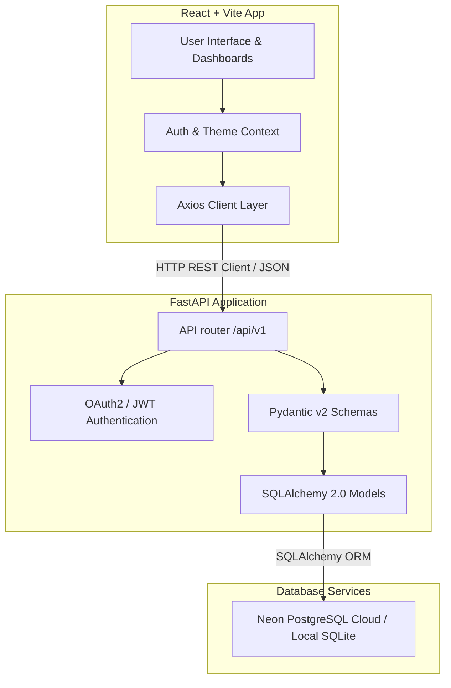

# 📦 Tirupati Inventory & Order Management System

[](https://fastapi.tiangolo.com)
[](https://react.dev)
[](https://www.typescriptlang.org)
[](https://vitejs.dev)
[](https://neon.tech)
[](https://www.docker.com)
[](https://pytest.org)

An enterprise-grade, high-concurrency **Inventory & Order Management System** built using a **FastAPI backend** (Python 3.12), a **React + Vite frontend** (TypeScript), and a **Neon Cloud Serverless PostgreSQL** database.

This project delivers a premium **glassmorphic desktop/mobile user interface** utilizing Vanilla HSL design tokens, custom micro-animations, day/night theme synchronizations, and advanced database integrity controls (such as atomic transaction row locks).

---

## 🌟 Key Highlights & Features

### 🛒 High-Concurrency Order Desk
* **Database Row Locking**: Issues explicit PostgreSQL row-level locks (`with_for_update()`) on product stock records at checkout, preventing race conditions or double-spend errors under heavy order concurrency.
* **Atomic Transactions**: Deducts stock, registers line items, and inserts order logs inside a single transaction context—triggering `db.rollback()` on any failure to guarantee database state integrity.
* **Captured Historical Pricing**: Persists the exact checkout price inside order details, safeguarding transaction records from future product catalog price adjustments.
* **Dynamic Stock Checkers**: Renders real-time availability counters inside product dropdowns directly upon user selection.

### 📦 Product & Inventory Lifecycle
* **Full CRUD Lifecycle**: Register, retrieve, update, and catalog system products.
* **SKU Uniqueness Constraints**: Enforces indexed, unique Stock Keeping Unit (SKU) validations both at the Pydantic API layer and DB level.
* **Live Catalog Metrics**: Interactive statistics detailing out-of-stock items (Red), low stock alerts under 10 units (Orange), and healthy stock quantities (Green).

### 👥 Customer Accounts & Hardened Security
* **RFC-Compliant Emails**: Rigorous schema checks utilizing Pydantic `EmailStr` to guarantee strictly formatted customer entries.
* **Password Complexity**: Enforces a strict minimum **8-character password policy** aligned seamlessly between Pydantic schemas and frontend views (`Signup.tsx` and `Profile.tsx`).
* **Secure JWT Session Control**: Implements access tokens utilizing HS256 signatures with a 24-hour expiration window to limit session exposure.

### 📱 Premium Responsive Mobile Layout
* **Glassmorphic Navigation Drawer**: Automatically transitions from the horizontal inline navbar on desktop viewports to a clean top header and sliding hamburger navigation drawer on mobile/tablet viewports (`< 768px`).
* **Personalized User Widget**: Features a custom-rendered profile card detailing the active customer's name, avatar, and security clearance level (Admin/Customer).
* **Smooth Transitions**: Powered by hardware-accelerated animations (`slideInRight`) and blurred backdrop overlays for a premium native application feel.
* **Harmonious Theme Synchronization**: HSL-tailored day/night modes synchronize seamlessly across modern dashboard grids, tables, and modal drawers.

---

## 🏗️ System Architecture



---

## 🗄️ Database ERD / Schema

The system uses four main tables. Relationships are managed via foreign keys with cascading options:

```
  ┌───────────────┐          ┌───────────────┐
  │   customers   │ 1      * │    orders     │
  ├───────────────┤──────────┼───────────────┤
  │ id (PK)       │          │ id (PK)       │
  │ name          │          │ customer_id   │──┐
  │ email (UQ)    │          │ total_amount  │  │
  │ role          │          │ created_at    │  │
  │ password_hash │          └───────────────┘  │
  └───────────────┘                             │
                                                │ 1
  ┌───────────────┐          ┌───────────────┐  │
  │   products    │ 1      * │  order_items  │  │
  ├───────────────┤──────────┼───────────────┤  │
  │ id (PK)       │          │ id (PK)       │  │
  │ name          │          │ order_id (FK) │<─┘
  │ sku (UQ)      │          │ product_id    │
  │ price         │          │ quantity      │
  │ stock_quantity│          │ price         │
  └───────────────┘          └───────────────┘
```

* **Customers**: Manages credentials and roles (`admin` or `customer`). Has a 1-to-many relationship with **Orders**.
* **Products**: Stores inventory items with unique SKU codes.
* **Orders**: Groups purchases for a customer, recording total spend.
* **OrderItems**: Connects orders to products, persisting the unit price *at the exact moment of order* (historical price preservation).

---

## 📂 Project Directory Structure

```
inventory-order-management-system/
├── backend/
│   ├── app/
│   │   ├── api/             # API Router definitions (v1 endpoints)
│   │   ├── core/            # Config, security, and database connection setup
│   │   ├── crud/            # Database CRUD implementation helpers
│   │   ├── models/          # SQLAlchemy declarative base models
│   │   ├── schemas/         # Pydantic data schemas & validators
│   │   ├── services/        # Checkout and order placement business logic
│   │   └── tests/           # Comprehensive Pytest suite
│   ├── alembic/             # Database migration configuration scripts
│   ├── requirements.txt     # Python dependencies list
│   └── main.py              # Application entrypoint
├── frontend/
│   ├── src/
│   │   ├── assets/          # Global assets & static files
│   │   ├── components/      # Common UI elements (Modals, Buttons, Forms)
│   │   ├── context/         # AuthContext, ThemeContext providers
│   │   ├── features/        # Module-specific pages (Products, Orders, Dashboard)
│   │   ├── hooks/           # Custom React hooks
│   │   ├── services/        # Axios API clients
│   │   └── App.tsx          # React main layout & routing declarations
│   ├── package.json         # NPM script mappings & dependencies
│   └── vite.config.ts       # Vite-specific parameters and dev server proxies
├── docker-compose.yml       # Production-ready compose configuration
└── README.md                # System documentation
```

---

## 📋 Environment Variables Reference

### Backend Settings (`/backend/.env`)
| Variable | Description | Example / Default |
| :--- | :--- | :--- |
| `PROJECT_NAME` | The title of your system | `"Inventory & Order Management System"` |
| `ENVIRONMENT` | Toggle context (disables Swagger docs in `production`) | `development` |
| `SECRET_KEY` | Cryptographic signature salt for JWT generation | `dev_secret_key_for_local_testing_only` |
| `BACKEND_CORS_ORIGINS` | Comma-separated list of allowed origins | `http://localhost:3000,http://127.0.0.1:3000` |
| `DATABASE_URL` | Cloud PostgreSQL or Local connection string | `postgresql://[user]:[pwd]@[host]/neondb?sslmode=require` |

### Frontend Settings (`/frontend/.env`)
| Variable | Description | Example / Default |
| :--- | :--- | :--- |
| `VITE_API_URL` | Endpoint pointing to backend REST API v1 path | `http://127.0.0.1:8000/api/v1` |

---

## 🚀 Local Setup Instructions

Ensure you have **Python 3.12** and **Node.js (v18+)** installed.

### 1. Backend Setup (FastAPI)

1. **Navigate to the backend directory and create a virtual environment**:
   ```bash
   cd backend
   python -m venv venv
   ```
2. **Activate the virtual environment**:
   * **On Windows (PowerShell / cmd)**:
     ```powershell
     .\venv\Scripts\activate
     ```
   * **On macOS/Linux**:
     ```bash
     source venv/bin/activate
     ```
3. **Install core dependencies**:
   ```bash
   pip install -r requirements.txt
   ```
4. **Configure Environment Variables**:
   Create a `.env` file from the example:
   ```bash
   cp .env.example .env
   ```
   *Note: Open `.env` and fill in your connection `DATABASE_URL` (SQLite file `sqlite:///./inventory.db` or Neon PostgreSQL).*
5. **Run DB Migrations**:
   Ensure Alembic upgrades the schema:
   ```bash
   alembic upgrade head
   ```
6. **Run the Diagnostic Test Suite**:
   ```bash
   python -m pytest
   ```
7. **Start the FastAPI Application Server**:
   ```bash
   python -m uvicorn app.main:app --host 127.0.0.1 --port 8000 --reload
   ```
   The backend API docs will be active at `http://127.0.0.1:8000/docs`.

---

### 2. Frontend Setup (React + Vite)

1. **Navigate to the frontend directory and install dependencies**:
   ```bash
   cd ../frontend
   npm install
   ```
2. **Configure Environment Variables**:
   Verify `/frontend/.env` is set up with the correct API URL:
   ```env
   VITE_API_URL=http://127.0.0.1:8000/api/v1
   ```
3. **Start the local development server**:
   ```bash
   npm run dev
   ```
   Vite will host the web interface at `http://localhost:3000`.

---

## 🐳 Docker Container Orchestration

To run the entire stack (PostgreSQL database service, FastAPI REST backend, and Nginx frontend web server) locally with a single command:

```bash
docker compose up --build
```

### Port Mappings
* **React Web UI**: `http://localhost:3000`
* **FastAPI Swagger Docs**: `http://localhost:8000/docs`
* **PostgreSQL Database Server**: `localhost:5432`

---

## 🛡️ Verification Results & Quality Auditing

* **TypeScript Static Verification**: `npx tsc --noEmit` returns `0` compilation errors.
* **FastAPI Pytest Test Suite**: `python -m pytest` executes 23 unit/integration tests covering orders, atomic transactions, profile updates, and dashboard metrics, returning **23 passed successfully** (100% pass rate).