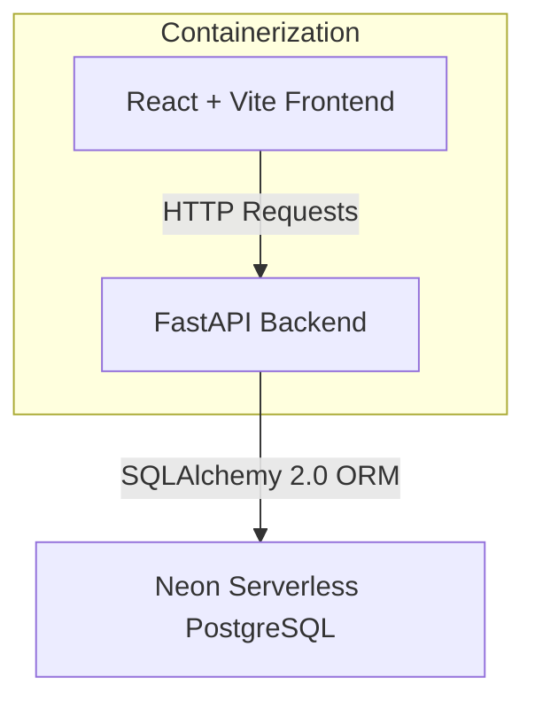

# Inventory & Order Management System

A premium, production-grade technical assessment application built with a **FastAPI backend** (Python 3.12), a **React + Vite frontend** (TypeScript), and **Neon Serverless PostgreSQL**. 

This system integrates real-time inventory tracking, customer profiles, and order placement under connection locks and atomic database transactions.

---

## 1. Project Overview
The **Inventory & Order Management System** is a full-stack dashboard designed to handle high-concurrency order placement and live stock inventory tracking. It provides a visual dashboard for administrators and operations desks to manage products, record customer profiles, and process orders atomically.

---

## 2. Key Features

### 📦 Product & Inventory Management
* **Full CRUD Lifecycle**: Register, retrieve, update, and delete products from the catalog.
* **SKU Uniqueness**: Enforces indexed, unique Stock Keeping Unit (SKU) validation both at the Pydantic API entrance and database constraint layers.
* **Smart Stock Indicators**: Responsive UI tags flagging out-of-stock items (Red), low stock levels under 10 units (Orange), and healthy stock quantities (Green).

### 👥 Customer Directory
* **Full CRUD Lifecycle**: Manage customer accounts and profiles.
* **RFC-Compliant Email Validation**: Integrates Pydantic `EmailStr` validations to ensure strictly formatted email entries.
* **Email Uniqueness**: Enforces strict unique constraints to prevent duplicate customer profiles.

### 🛒 Transaction-Safe Order Desk
* **Dynamic Stock Visualizers**: Displays real-time stock levels directly inside the product checkout dropdown as soon as a product is selected.
* **Cart Array**: Supports placing orders containing multiple products and varying quantities in a single transaction.
* **Database Row Locking**: Issues database row-level locking (`with_for_update()`) on product rows to completely prevent concurrency race conditions (e.g., double-spending stock).
* **Atomic Transactions**: Groups checks, stock deductions, order insertions, and line item entries in a single block. It commits changes only on complete success and triggers `db.rollback()` on any failure.
* **Historical Pricing**: Captures and stores the exact unit price at checkout inside order line items to preserve financial records, shielding transaction history from future catalog updates.

### 🌐 High-End Developer Experience
* **Professional Swagger `/docs`**: Enriched with detailed field descriptions, realistic Pydantic JSON schema examples, and explicit HTTP error response maps (e.g., SKU/Email collisions or stock deficits).
* **Resilient Connection Pools**: Tailored connection pooling (`pool_size`, `max_overflow`, `pool_recycle`, `pool_pre_ping`) optimized for Serverless cloud databases like **Neon**.
* **Docker Multi-Stage Deployments**: Packs frontend assets into Nginx containers configured with fallback SPA routing rules to prevent Router refresh errors.

---

## 3. System Architecture



* **Frontend**: React (v18), Vite, TypeScript, Axios (API Client Service Layer), Lucide Icons, Vanilla HSL CSS variables design system.
* **Backend**: FastAPI (Python 3.12), Pydantic (v2 validation), python-dotenv.
* **Database & ORM**: PostgreSQL (Neon Cloud), SQLAlchemy (2.0 ORM), Alembic (Schema Migrations).
* **Orchestration**: Docker, Docker Compose, Nginx (Frontend Web Server).

---

## 4. Environment Variables Reference

### Backend (`/backend/.env`)
| Variable | Description | Example / Default |
| :--- | :--- | :--- |
| `PROJECT_NAME` | The title of your system | `Inventory & Order Management System` |
| `ENVIRONMENT` | Environment toggle (disables Swagger docs in `production`) | `development` |
| `SECRET_KEY` | Random key for session tokens and encryption | `supersecretkeyforlocaltesting` |
| `BACKEND_CORS_ORIGINS` | Comma-separated list of allowed origins | `http://localhost:3000,http://127.0.0.1:3000` |
| `DATABASE_URL` | Neon Pooled PostgreSQL connection string | `postgres://[user]:[pwd]@[host]/neondb?sslmode=require` |

### Frontend (`/frontend/.env`)
| Variable | Description | Example / Default |
| :--- | :--- | :--- |
| `VITE_API_URL` | Public endpoint pointing to backend API v1 path | `http://localhost:8000/api/v1` |

---

## 5. Local Setup Instructions

### Backend (FastAPI)
1. **Navigate and create a virtual environment**:
   ```bash
   cd backend
   python -m venv venv
   source venv/bin/activate  # On Windows: venv\Scripts\activate
   ```
2. **Install dependencies**:
   ```bash
   pip install -r requirements.txt
   ```
3. **Configure Environment**:
   Copy `.env.example` to `.env` and fill in your details (e.g. Neon DATABASE_URL).
4. **Run DB Migrations**:
   ```bash
   alembic upgrade head
   ```
5. **Run DB Connection Diagnostic Test**:
   ```bash
   python test_connection.py
   ```
6. **Start the server**:
   ```bash
   uvicorn app.main:app --host 0.0.0.0 --port 8000 --reload
   ```

### Frontend (React + Vite)
1. **Navigate and install dependencies**:
   ```bash
   cd frontend
   npm install
   ```
2. **Configure Environment**:
   Copy `.env.example` to `.env` and verify your `VITE_API_URL` endpoint path.
3. **Start the local development server**:
   ```bash
   npm run dev
   ```
   Open `http://localhost:3000` in your web browser.

---

## 6. Docker Container Orchestration

Run the entire system (local PostgreSQL db, backend, and frontend) with a single command using Docker Compose:

```bash
docker compose up --build
```

### Port Mappings
* **React Web Frontend**: `http://localhost:3000` (Served via production-ready Nginx)
* **FastAPI Backend Swagger**: `http://localhost:8000/docs`
* **Local PostgreSQL Server**: `localhost:5432`

*Note: The backend service container implements an automated healthcheck using `pg_isready` and will delay its boot sequence until the PostgreSQL DB is fully operational.*

---

## 7. API Documentation Summary
FastAPI automatically generates fully descriptive OpenAPI schemas. You can access the interactive portals here:
* **Interactive Swagger UI**: `/docs` (e.g. `http://localhost:8000/docs`)
* **Redoc System Specs**: `/redoc` (e.g. `http://localhost:8000/redoc`)

### Main Route Table
* `GET /`: API Health Check and Environment summary.
* **Products**:
  - `POST /api/v1/products/`: Register a new product (uniqueness check).
  - `GET /api/v1/products/`: Get products with pagination limit/skip.
  - `GET /api/v1/products/{id}`: Fetch product details by ID.
  - `PUT /api/v1/products/{id}`: Update catalog attributes.
  - `DELETE /api/v1/products/{id}`: Remove product.
* **Customers**:
  - `POST /api/v1/customers/`: Register customer (email format & uniqueness check).
  - `GET /api/v1/customers/`: Fetch registered customers.
  - `GET /api/v1/customers/{id}`: Fetch customer profile by ID.
  - `PUT /api/v1/customers/{id}`: Update customer profile details.
  - `DELETE /api/v1/customers/{id}`: Remove customer.
* **Orders**:
  - `POST /api/v1/orders/`: Submit a purchase order (atomic stock checking & deduction transaction).
  - `GET /api/v1/orders/`: Retrieve all order logs.
  - `GET /api/v1/orders/{id}`: Fetch single order breakdown with purchased line items.

---

## 8. GitHub Repository Integration
To publish this workspace onto your public GitHub registry:

1. **Initialize Git in root directory**:
   ```bash
   git init
   ```
2. **Add all files**:
   ```bash
   git add .
   ```
3. **Commit the changes**:
   ```bash
   git commit -m "feat: complete production ready database models, CRUD APIs, and React frontend dashboard"
   ```
4. **Create a remote repository** on GitHub.
5. **Link and push**:
   ```bash
   git remote add origin https://github.com/yourusername/inventory-order-management-system.git
   git branch -M main
   git push -u origin main
   ```

---

## 9. Public Deployment Directory

| Service Component | Cloud Provider | Public Deployment URL |
| :--- | :--- | :--- |
| **Backend API** | Railway | *[Deploy to Railway and insert generated URL here]* |
| **Frontend Web** | Railway (Nginx) | *[Deploy to Railway and insert generated URL here]* |
| **Database Instance** | Neon Console | *[Connect your serverless database instance]* |