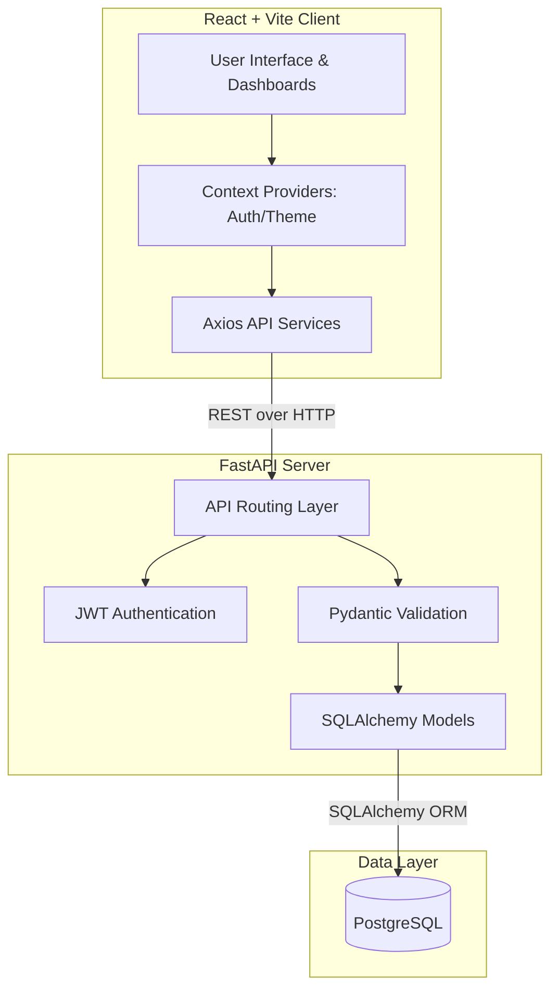

# 📦 Inventory & Order Management System

[](https://fastapi.tiangolo.com)
[](https://react.dev)
[](https://www.typescriptlang.org)
[](https://vitejs.dev)
[](https://www.postgresql.org/)
[](https://www.docker.com)

A robust, full-stack **Inventory and Order Management System** engineered for high-concurrency order processing, real-time inventory tracking, and seamless user experiences. 

Built with a **FastAPI** backend and a **React + Vite** frontend, the system guarantees database integrity using advanced transactional controls and offers a premium, responsive glassmorphic UI.

---

## ✨ Key Features

### 🛒 Resilient Order Processing
- **Concurrency Control**: Implements PostgreSQL row-level locks (`SELECT ... FOR UPDATE`) to eliminate race conditions and double-spending during simultaneous checkouts.
- **Atomic Transactions**: Guarantees data consistency by wrapping stock deductions, line-item creation, and order logging in a single database transaction with automatic rollback on failure.
- **Price Immutability**: Captures and persists the exact checkout price in the order details, protecting historical records from future catalog price changes.

### 📦 Inventory Management
- **Complete Product Lifecycle**: Create, read, update, and manage product catalog data seamlessly.
- **SKU Integrity**: Enforces unique Stock Keeping Unit (SKU) validations at both the application (Pydantic) and database levels.
- **Real-Time Stock Alerts**: Dynamic UI indicators highlight low-stock (orange) and out-of-stock (red) items instantly.

### 🔐 Security & Authentication
- **Secure Sessions**: JWT-based authentication using HS256 signatures with controlled expiration windows.
- **Strict Validation**: RFC-compliant email verification and strict password complexity policies enforced via Pydantic.
- **Role-Based Access**: Segregated capabilities for `admin` and standard `customer` accounts.

### 💻 Modern, Responsive UI
- **Glassmorphic Design**: A premium interface featuring blurred backdrops, smooth hardware-accelerated animations, and tailored HSL color tokens.
- **Adaptive Layouts**: Seamlessly transitions from a comprehensive desktop dashboard to an intuitive mobile navigation drawer.
- **Theme Synchronization**: Integrated Day/Night modes across the entire application interface.

---

## 🏗️ Architecture



---

## 🗄️ Database Schema

The core domain model consists of four interconnected tables:

* **Customers**: User identities, roles, and hashed credentials.
* **Products**: Inventory catalog with unique SKUs and current stock levels.
* **Orders**: Aggregated customer purchases.
* **Order Items**: Line items connecting an Order to a Product, preserving the historical unit price.

---

## 🚀 Getting Started

### Prerequisites
- **Docker** & **Docker Compose** (Recommended)
- **Node.js** (v18+) & **Python** (3.12+) for local development

### Method 1: Docker (Recommended)
Launch the entire stack (PostgreSQL, FastAPI Backend, React Frontend) with a single command:

```bash
# Build and start all services
docker-compose up --build
```
- **Web UI**: `http://localhost:3000`
- **API Server**: `http://localhost:8000`
- **API Documentation**: `http://localhost:8000/docs`

### Method 2: Local Development

#### 1. Backend API
```bash
cd backend
python -m venv venv

# Activate virtual environment
# Windows: .\venv\Scripts\activate
# macOS/Linux: source venv/bin/activate

# Install dependencies
pip install -r requirements.txt

# Configure environment
cp .env.example .env
# Edit .env and supply your DATABASE_URL

# Apply database migrations
alembic upgrade head

# Start development server
python -m uvicorn app.main:app --host 127.0.0.1 --port 8000 --reload
```

#### 2. Frontend Client
```bash
cd frontend

# Install dependencies
npm install

# Configure environment
cp .env.example .env
# Ensure VITE_API_URL=http://localhost:8000/api/v1 is set

# Start development server
npm run dev
```

---

## 📂 Project Structure

```text
inventory-order-management-system/
├── backend/
│   ├── app/                 # FastAPI application core
│   │   ├── api/             # Route handlers & endpoints
│   │   ├── core/            # Config & Security utilities
│   │   ├── models/          # SQLAlchemy definitions
│   │   └── schemas/         # Pydantic models
│   ├── alembic/             # Database migrations
│   ├── tests/               # Pytest test suite
│   ├── requirements.txt     # Python dependencies
│   └── main.py              # Application entrypoint
├── frontend/
│   ├── src/                 # React application code
│   │   ├── components/      # Reusable UI elements
│   │   ├── features/        # Domain-specific modules (Auth, Inventory, Orders)
│   │   └── services/        # Axios API clients
│   ├── package.json         # Node.js dependencies
│   └── vite.config.ts       # Vite configuration
└── docker-compose.yml       # Docker orchestration configuration
```

---

## 🛡️ Testing & Quality Assurance

To ensure system reliability, the backend features a comprehensive test suite. Run the tests using Pytest:

```bash
cd backend
python -m pytest
```

---
*Built with ❤️ for High-Performance Operations.*